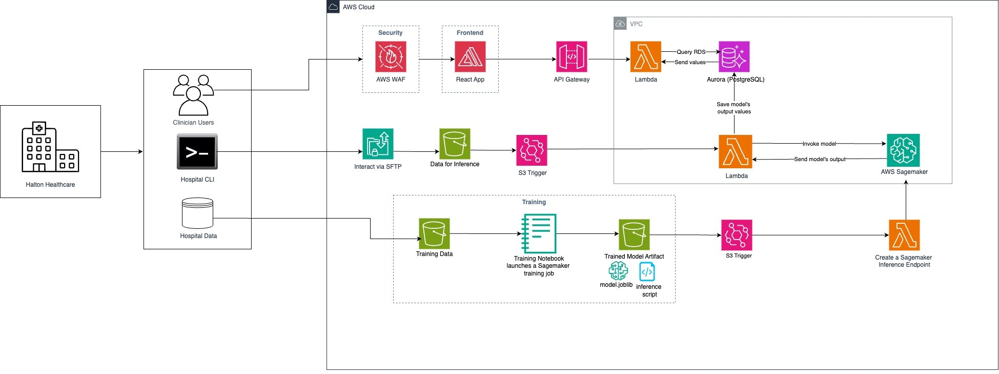

# Hospital Admissions Forecasting

This project involves a machine learning (ML) model to predict hospital admissions using data collected in an Emergency Room (ER).


| Index                                               | Description                                             |
| :-------------------------------------------------- | :------------------------------------------------------ |
| [Motivation and Project Overview](#motivation-and-project-overview) | High level overview describing the project motivation and solution |
| [High Level Architecture](#high-level-architecture) | High level overview illustrating component interactions |
| [Training and Experimentation Guide](#training-and-experimentation) | Guide on comparing different models, viewing results and launching a final training job to generate a model for deployment |
| [Deployment](#deployment-guide)                     | How to deploy the project                               |
| [Dashboard Interface Guide](#dashboard-interface-guide)                           | How to interact with the solution dashboard                                    |
| [Directories](#directories)                         | General project directory structure                     |
| [API Documentation](#api-documentation)             | Documentation on the API the project uses               |
| [Changelog](#changelog)                             | Any changes post publish                                |
| [Credits](#credits)                                 | Meet the team behind the solution                       |
| [License](#license)                                 | License details                                         |

## Motivation and Project Overview

When a patient visits an ER, typically they are triaged by ER nurses to collect preliminary information about the visit, and a few hours later, the patient receives a decision from a doctor regarding hospital admission. A ML model that can predict hospital admissions at the time of triage could potentially save the ER time to coordinate beds and allocate staffing resources.

A random forest classifier was identified as the best classifier for the task. This solution prototype includes a dashboard for ER clinicians to sort ER patients by the model output and thus urgency/likelihood of patient admissions.

The solution utilises AWS resources to host a trained ML model and provide a dashboard with patient information.

## High-Level Architecture

The following architecture diagram illustrates the various AWS components utilized to deliver the solution.




## Training and Experimentation

This solution enables users with ML knowledge to fine-tune and test out different models using Sagemaker Notebooks. For details, please refer to the [Training and Experimentation Guide](./docs/training-and-experimentation-guide.md).

## Deployment Guide

To deploy this solution, please follow the steps laid out in the [Deployment Guide](./docs/deploymentGuide.md)

## Dashboard Interface Guide

Please refer to the [Interface Guide](./docs/interfaceGuide.md) for instructions on navigating the dashboard interface.

<!--  -->
<!-- *Dashboard Preview* -->

## Directories

```

├── cdk
│   ├── bin
│   ├── lambda
│   ├── layers
│   ├── lib
├── docs
└── frontend
    ├── public
    └── src
        ├── assets
        ├── components
        ├── functions
        └── pages
```

1. `/cdk`: Contains the deployment code for the app's AWS infrastructure
    - `/bin`: Contains the instantiation of CDK stack
   course when files are uploaded or deleted.
    - `/lambda`: Contains the lambda functions for the project
    - `/layers`: Contains the required layers for lambda functions
    - `/lib`: Contains the deployment code for all infrastructure stacks
2. `/docs`: Contains documentation for the application
3. `/frontend`: Contains the user interface of the application
    - `/public`: public assets used in the application
    - `/src`: contains the frontend code of the application
        - `/assets`: Contains assets used in the application
        - `/components`: Contains components used in the application
        - `/functions`: Contains utility functions used in the application
        - `/pages`: Contains pages used in the application

## API Documentation

Here you can learn about the API the project uses: [API Documentation](./docs/api-documentation.md).

## Changelog

N/A


## Credits

This application was architected and developed by [Rohit Murali](https://www.linkedin.com/in/muralirohit), [Khushi Narang](https://www.linkedin.com/in/khushi-narang-2029a9213), with project assistance and front-end development support by [Amy Cao](https://www.linkedin.com/in/amy-c-2313121b1/). Thanks to the UBC Cloud Innovation Centre Technical and Project Management teams for their guidance and support.

## License

This project is distributed under the [MIT License](LICENSE).
