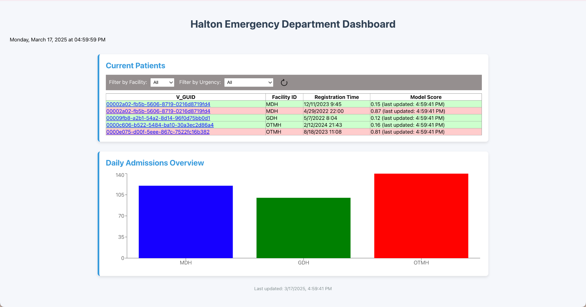
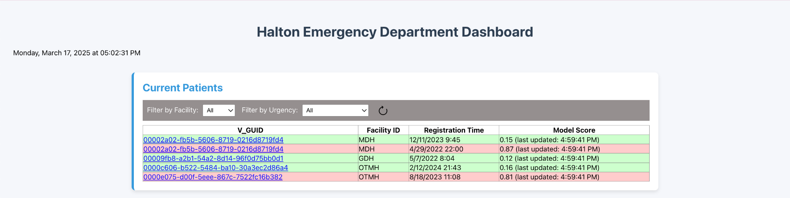
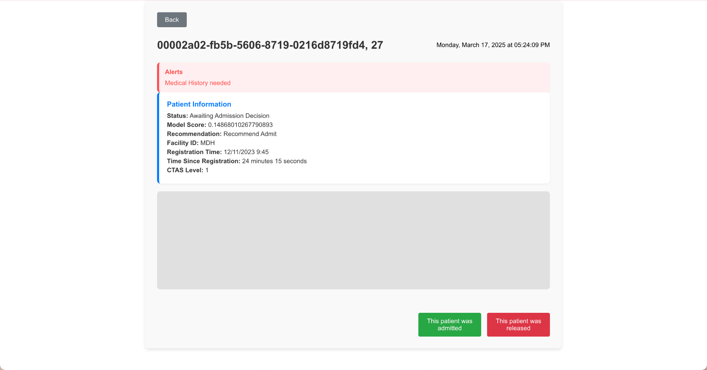
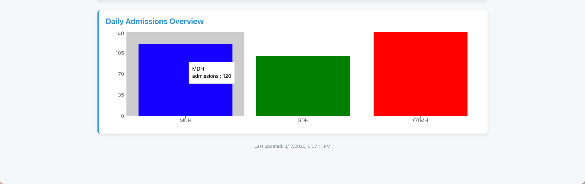

# Interface Guide

[Please ensure the application is deployed, instructions in the
deployment guide here:](./deploymentGuide.md)

Once you have deployed the solution, the following user guide will help
you navigate the functions available.

Upon opening the application, the user will see the following home
page:

The Current Patients table displays a list of patients, each identified
by their unique V_GUID, Facility ID, Registration Time, and Model Score.
Users can filter the table by Facility and Urgency to refine the
displayed results.

Upon clicking the refresh button, the model score updates in real-time.

Clicking on a V_GUID opens the patient details page, where any alerts
are displayed at the top. Below the alerts, the Patient History section
provides information on the patient's status, model score, admission
recommendation, Facility ID, registration time, time since registration,
and CTAS Level. Clicking the 'This patient was released' button will
remove the patient from the Current Patients table.

Clicking the 'This patient was admitted' button updates the Daily
Admission Overview bar graph for the respective facility. Hovering over
each bar allows users to see the exact number of admissions.
