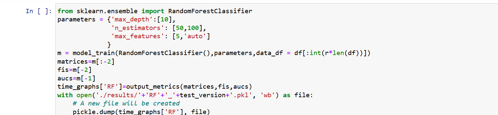
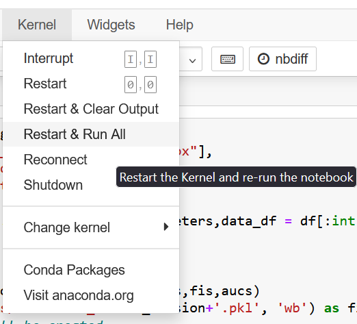
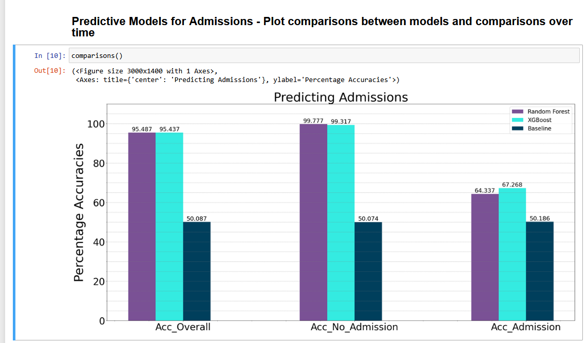
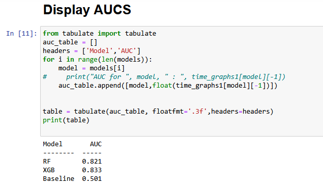
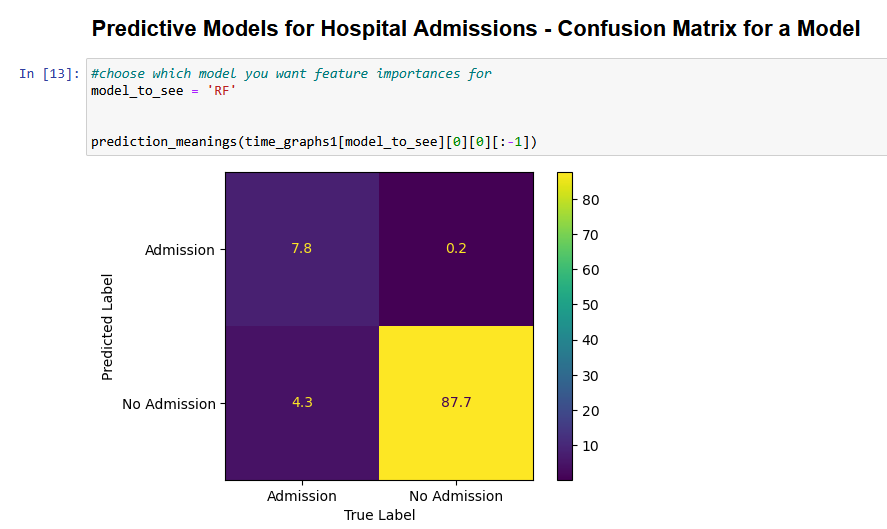
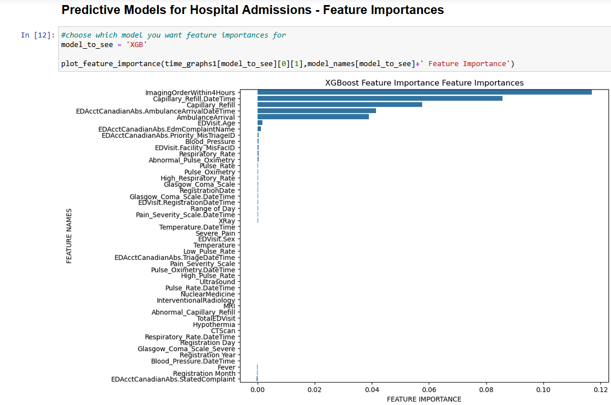

# Training Models Using Triage Data

## Table of Contents
1. [Overview](#overview)
2. [Directory Structure](#directory-structure)
3. [Usage Overview](#usage-overview)
   - [Preliminary Training and Testing of Models](#preliminary-training-and-testing-of-models)
   - [Launching a Training Job with a Finalized Model](#launching-a-training-job-with-a-finalized-model)
4. [Train_models_cv Notebook](#train_models_cv-notebook)
   - [Overview](#overview-1)
   - [Configuration Parameters](#configuration-parameters)
   - [Usage](#usage)
5. [Visualize_Results Notebook](#visualize_results-notebook)
   - [Overview](#overview-2)
   - [Usage](#usage-1)

## Overview

This guide provides a description of training a model using triage data, viewing results, and choosing an appropriate model to deploy for the Sagemaker endpoint. These Jupyter files can be run on an `ml.t2.medium` Sagemaker notebook.

## Directory Structure

The Sagemaker Jupyter Notebook contains the following files and folders:

```
|---- README.md
|---- launch_training_job.ipynb
|---- Explore_Features.ipynb
|---- Visualize_Results.ipynb
|---- Train_models_cv.ipynb
|---- code/
|    |---- config.py
|    |---- rf_script.py
|    |---- xgb_script.py
|    |---- requirements.txt
```

## Usage Overview

### Preliminary Training and Testing of Models

Preliminary training, testing, and experimentation can be done via the `Train_models_cv.ipynb` notebook, which runs cross-validation with a grid search to help the user understand the performance of models.

The cells at the end of the training notebook enable one to select which models to train along with an appropriate range of parameters to use in the Grid Search. The results of the respective models will be saved to the local results folder using the 'test_version' suffix to organize different experiments.



Please ensure to restart and run all cells each time in the notebook to avoid any overlap of variables:



Once models are trained and tested using cross-validation, results are stored and can be viewed using `Visualize_Results.ipynb`. The following are screenshots of the different capabilities of this notebook.




*Compare Model Accuracy* *Look at AUC Scores*




*Plot Confusion Matrices* *Examine Feature Importance*

### Launching a Training Job with a Finalized Model

Once you have decided which model to select, you can edit the `config.py` file to select the final model and the final list of parameters for the model.

Once this is configured, you may run the `launch_training_job.ipynb` notebook to launch the training job and save the model artifact to a specified S3 directory so it can be deployed as an endpoint for inference.

The `instance_type` variable lets you choose a specific EC2 instance to launch the training job. It currently defaults to `ml.c5.18xlarge`, for which training takes ~120 seconds.

## Train_models_cv Notebook

### Overview

This notebook handles model training with cross-validation, allowing evaluation of different models using various configurations and hyperparameters.

### Configuration Parameters

#### General Settings
- **results_folder**: Directory where output files and trained models are stored.
- **output_file**: Name of the output file for storing results.
- **folds**: Number of cross-validation folds used for training and validation.

#### Time and Data Processing
- **all_times**: A list of time windows used for evaluating models.
- **time_range**: Specific time intervals for generating features and performing analysis.
- **window_size**: Length of time windows used to process and aggregate event data.
- **timeToDeadline**: Time remaining before a deadline when an event occurs, used for feature extraction.

#### Model Hyperparameters
- **hmm_components**: Number of hidden states in the Hidden Markov Model (HMM).
- **lstm_units**: Number of units in each LSTM layer.
- **learning_rate**: Step size for updating model weights.
- **batch_size**: Number of training samples per update.
- **epochs**: Number of times the model sees the entire training dataset.
- **dropout_rate**: Fraction of neurons dropped to prevent overfitting.
- **grid_search**: Whether to perform hyperparameter tuning using grid search.
- **cv_splits**: Number of data splits used for cross-validation.
- **regularization**: Strength of L1/L2 regularization.

#### Training and Evaluation
- **metrics**: List of evaluation metrics (e.g., accuracy, log loss, F1-score).
- **test_size**: Proportion of the dataset reserved for testing.
- **train_size**: Proportion of the dataset used for training.
- **random_seed**: Seed value for reproducibility.
- **early_stopping**: Whether to stop training when validation performance stops improving.
- **patience**: Number of epochs without improvement before early stopping is triggered.
- **scoring_method**: Scoring method used for model selection.
- **model_type**: Specifies the type of model (e.g., HMM, LSTM, classifiers).
- **verbose**: Controls the level of output logging during training.

### Usage
1. Run `Train_models_cv.ipynb` to perform cross-validation and evaluate models.
2. Modify hyperparameters and configurations to experiment with different settings.
3. Review stored results in `results_folder` for further analysis.

For further customization, modify the `params` module or update configuration settings within the notebook.

## Visualize_Results Notebook

### Overview

This notebook generates visualizations and performance metrics for trained models to analyze results and compare different configurations.

### Usage
1. Run `Visualize_Results.ipynb` to generate performance plots.
2. Customize visualization settings to improve interpretability.
3. Save or export figures for reports or presentations.

For further customization, modify the visualization settings directly within the notebook.
